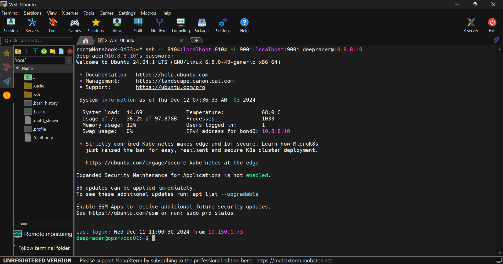
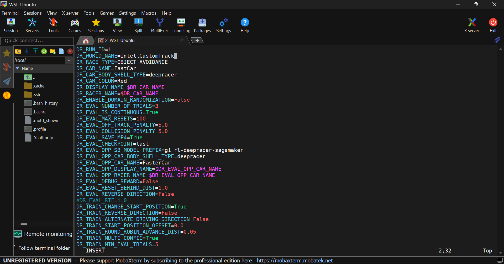
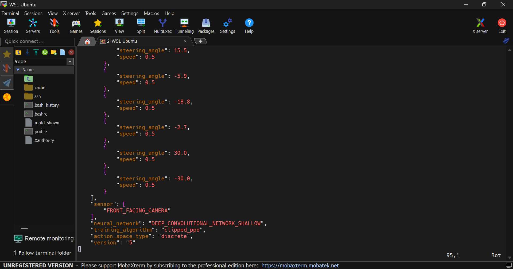
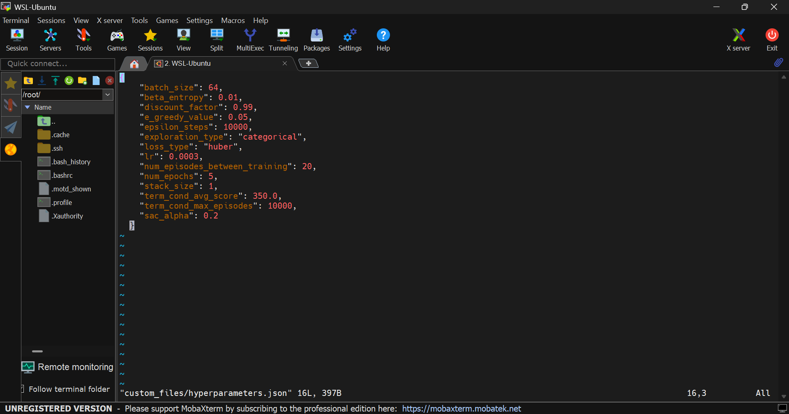
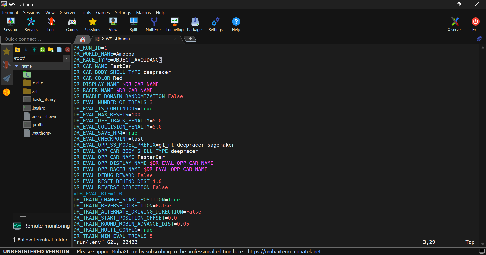
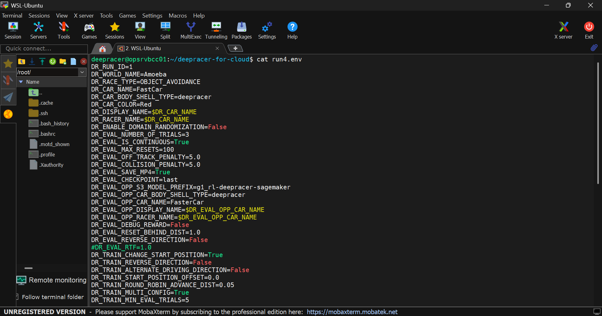
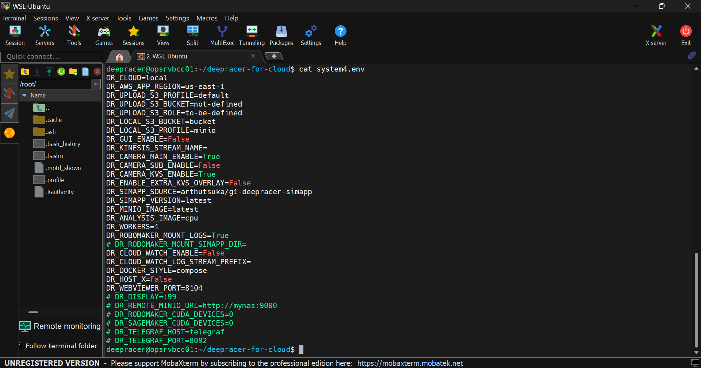
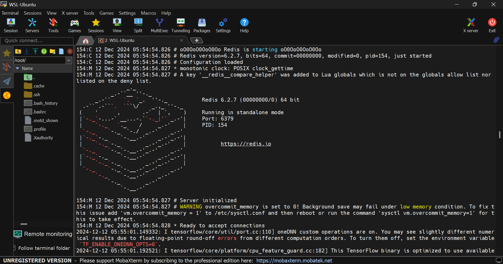
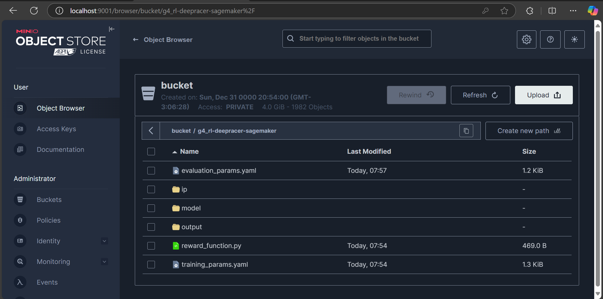

Este documento fornece instruções detalhadas sobre como acessar, configurar, treinar e gerenciar modelos no DeepRacer for Cloud. A plataforma utiliza o MobaXterm como terminal principal para a conexão via SSH, mas também é possível realizar os mesmos procedimentos usando o CMD (Prompt de Comando) do Windows ou outros terminais compatíveis, como o PowerShell.

## 1. Como acessar o DeepRacer for Cloud no servidor

1. **Conectar ao servidor via SSH**:
   Utilize o comando abaixo para acessar o servidor e redirecionar as portas necessárias para o ambiente local:
   ```bash
   ssh -L 8104:127.0.0.1:8104 -L 9001:127.0.0.4:9001 deepracer@10.8.8.10
   ```

   - A porta **8104** é usada para a interface de visualização do treinamento.
   - A porta **9001** é usada para o acesso ao MinIO, que é onde os modelos e outros arquivos são armazenados.

   

2. **Acessar o diretório do DeepRacer**:
   Navegue até o diretório onde o código do DeepRacer está armazenado:
   ```bash
   cd deepracer-for-cloud
   ```

3. **Vincular arquivos de configuração do grupo**:
   Defina os arquivos de configuração para o seu grupo (no exemplo, para o grupo 4). Este comando cria um link simbólico para os arquivos de configuração específicos:
   ```bash
   ln -s custom_files4 custom_files
   ln -s system4.env system.env
   ```

4. **Ativar o ambiente com as configurações do seu grupo**:
   Carregue as variáveis de ambiente e as configurações necessárias para o correto funcionamento do treinamento, conforme o grupo definido:
   ```bash
   source bin/activate.sh run4.env
   ```

---

## **2. Como selecionar uma pista para treinamento**

1. **Editar a variável de ambiente `WORLD_NAME`**:
   - Abra o arquivo de configuração `run4.env` para ajustar o nome da pista desejada:
     ```bash
     vi run4.env
     ```
   - Exemplo para uma pista personalizada:
     ```bash
     WORLD_NAME=InteliCustomTrack
     ```

   

2. **Salvar e aplicar a configuração**:
   Após editar o arquivo, aplique as mudanças com o comando:
   ```bash
   source bin/activate.sh run4.env
   ```

---

## **3. Como selecionar os modelos de RL disponíveis**

1. **Editar o arquivo `model_metadata.json`**:
   Abra o arquivo `model_metadata.json` localizado em `custom_files` e altere o valor da chave `training_algorithm` para o algoritmo desejado:
   ```bash
   vi custom_files/model_metadata.json
   ```
   - Exemplo de conteúdo:
     ```json
     {
         "training_algorithm": "clipped_ppo"
     }
     ```

   

2. **Atualizar os arquivos customizados**:
   Para garantir que as alterações no arquivo de configuração sejam aplicadas corretamente, execute os seguintes comandos:
   ```bash
   dr-update && dr-update-env && dr-upload-custom-files
   ```

---

## **4. Como ajustar os hiperparâmetros**

1. **Editar o arquivo `hyperparameters.json`**:
   No arquivo `hyperparameters.json`, você pode modificar os valores dos hiperparâmetros para ajustar o treinamento, como o tamanho do lote (batch size), por exemplo:
   ```bash
   vi custom_files/hyperparameters.json
   ```
   - Exemplo de ajuste:
     ```json
     {
        "batch_size": 64
     }
     ```

   

2. **Aplicar as alterações**:
   Após editar o arquivo de hiperparâmetros, aplique as mudanças com o seguinte comando:
   ```bash
   dr-update && dr-update-env && dr-upload-custom-files
   ```

---

## **5. Como selecionar caixas de colisão**

1. **Editar a variável `DR_RACE_TYPE` no arquivo `run4.env`**:
   Abra o arquivo `run4.env` e altere a variável `DR_RACE_TYPE` para configurar o tipo de colisão (se necessário):
   ```bash
   vi run4.env
   ```

   

2. **Salvar e aplicar as alterações**:
   Após editar o arquivo, aplique as configurações:
   ```bash
   source bin/activate.sh run4.env
   ```

---

## **6. Como visualizar as variáveis de ambiente**

1. **Exibir variáveis configuradas**:
   Você pode visualizar as variáveis de ambiente configuradas para o treinamento e o sistema com os seguintes comandos:
   - Para o ambiente de execução:
     ```bash
     cat run4.env
     ```
   - Para o sistema:
     ```bash
     cat system4.env
     ```

   

   

---

## **7. Como iniciar o treinamento**

1. **Iniciar o treinamento**:
   Para começar o treinamento do modelo, utilize o comando:
   ```bash
   dr-start-training
   ```

   

2. **Monitorar o progresso**:
   Durante o treinamento, você pode monitorar o progresso através dos logs, que exibem métricas como `reward` e `step` a cada atualização.

---

## **8. Como realizar a avaliação (Evaluation)**

1. **Iniciar avaliação**:
   Para avaliar o desempenho do modelo treinado, execute o comando:
   ```bash
   dr-start-evaluation
   ```

2. **Visualizar os resultados**:
   Os resultados da avaliação estarão disponíveis no MinIO, onde você pode visualizar as métricas detalhadas e outras informações sobre o desempenho.

---

## **9. Como realizar o Deploy**

1. **Baixar o modelo treinado**:
   Acesse o MinIO para fazer o download do modelo treinado após a avaliação. O arquivo gerado estará disponível para ser baixado.

   

2. **Subir o modelo para o carrinho**:
   Conecte o carrinho via USB e faça o upload do modelo treinado para ser executado no dispositivo.

---

## **10. Continuidade de Treinamento entre Pistas**

1. **Salvar o modelo da pista A**:
   Complete o treinamento para a primeira pista (pista A) e salve o modelo gerado.

2. **Alterar para a pista B**:
   No arquivo `run4.env`, ajuste a variável `WORLD_NAME` para a nova pista (pista B):
   ```bash
   WORLD_NAME=reInvent2019_track
   ```

3. **Iniciar o treinamento a partir do modelo existente**:
   Para retomar o treinamento com o modelo salvo da pista A, execute o comando:
   ```bash
   dr-resume-training
   ```

4. **Aplicar ajustes nos hiperparâmetros**:
   Caso necessário, modifique o arquivo `hyperparameters.json` com ajustes específicos para a nova pista (pista B), e aplique as mudanças:
   ```bash
   dr-update && dr-update-env && dr-upload-custom-files
   ```